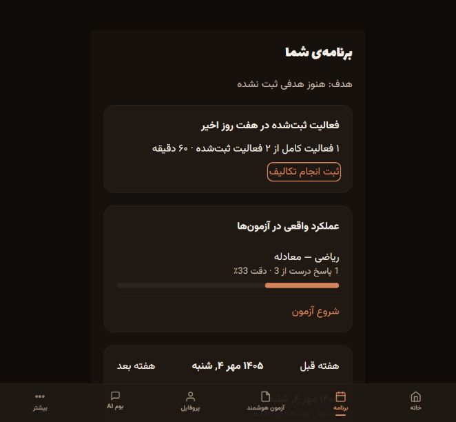

# Boom debugging audit — updated 2026-09-28

## Result and validation

The weekly-plan endpoint now invokes the deterministic constraint engine using the student's persisted availability, preferences, topic outcomes, recorded work, and upcoming assessments. The feedback loop is connected: complete a task or submit a mock, save the evidence, and use it on the next weekly generation. This supersedes the earlier September 27 report, which stopped before this integration.

Final checks:

- Full backend suite: **221 passed, 2 skipped**, 629 warnings, 41.93 seconds.
- Frontend state/synchronization regressions: **4 passed** (`npm test`).
- TypeScript `tsc --noEmit`: passed.
- Production frontend build: passed; approximately 1.02 MB main JS bundle, with existing bundle/config/import warnings.
- Python syntax: all 51 files under `backend/app` parsed.
- `git diff --check`: passed, with Windows line-ending notices.
- Browser journey on an isolated temporary SQLite database: passed for login, weekly generation, completion, saved exam, mock submission/results, evidence display, and two-account isolation.

Existing uncommitted project work was preserved. Nothing was committed or deployed. Automated tests use a temporary database rather than the application's normal SQLite file. No production account was created, SMS sent, or question pool restocked.

## Changes

### Planning and feedback

- Chronological scheduling prevents slot reuse and overlap. Split tasks conserve remaining minutes and question counts. Explicit zero-hour days stay empty. Fixed events, wake/sleep windows, daily budgets and maximum block lengths constrain allocation.
- Topic practice follows completed study; review follows its practice. Upcoming exam deadlines affect priority. A normal week reserves a timed mock and subsequent correction when capacity allows.
- Saved profile values override request defaults. Weakness uses correct/wrong/blank outcomes with an attempted-question denominator. Manual wrong-answer records are a fallback, not a fabricated accuracy percentage. Untested subjects use self-reported confidence/completion.
- Saved break style selects 25/5, 45/10, or 60/15 work/rest blocks, subject to the student's maximum contiguous duration. Study/practice preference changes allocations; workload preference changes the reserved fraction of free time.
- Incomplete sessions and tasks contribute only their remaining duration. Completed recovery work is deducted from its original backlog rather than recursively creating more debt.
- Generated work is persisted as TaskProgress. Completing or undoing a calendar task updates the same row. Regeneration preserves recorded outcomes, deducts recorded time from capacity, and creates fresh block IDs so old completion reports cannot overwrite new work.
- Past days and elapsed time today are unavailable to a new plan. Routine allocation uses 15-minute increments, although fixed-event boundaries and partial-task remainders can still produce shorter fragments.
- The older daily-task replanner now respects capacity even for urgent/high-priority work and repeated misses. Zero capacity no longer becomes 180 minutes. Invalid negative reports are rejected; carried remaining work resets its per-task actual-minute counter to avoid subtracting it twice.

### Frontend state and honesty

- Account-scoped caches cover schedule, profile, task completion, chat, and evaluation state. Async profile writes capture their original account. Legacy unscoped data is preserved on disk but is not guessed to belong to a newly logged-in student.
- Progress uses a persistent per-account outbox. Requests are serialized per account so completion/undo cannot finish in the wrong order. Failed reports remain queued; regeneration requires successful synchronization.
- Plan now shows server-backed activity, actual mock evidence, registered future exams, and a real Persian calendar. It provides a form to register upcoming exams.
- Home/Streak use recorded local completion rather than invented streaks, XP and personalization percentages. Countdown uses a registered exam and local calendar midnight; no invented Konkur date is shown.
- Schedule reports generation errors and insufficient-capacity results, preserves block metadata/question counts, saves valid empty weeks, and sends only the relevant fixed-event instances.
- Added accessible completion/logout labels. Removed unsupported promises of automatic page/test-number assignment from mock-result copy.

### Mock reliability and persistence

- `/api/mocks/history` no longer gets captured by the integer mock-ID route.
- Answer/configuration validation rejects malformed indices, booleans, negative counts/durations and invalid elapsed time. Numeric legacy answers and blanks remain supported.
- Retried mock submission returns the original outcome rather than adding another attempt and duplicate weakness records. Negative marking is consistent across total and per-subject scores.
- Failed generation refunds the reserved quota. Unverified questions are dropped; verified questions carry a persisted verification marker. Live/pool generation rejects incomplete required subject counts.
- Old or malformed unverified pool stock is quarantined rather than served. Mock and duel claims use a conditional database update, preventing the same pending booklet from being assigned twice.
- Study-session logging rejects invalid timestamps, reversed intervals, inconsistent answer totals, blank subjects, and another student's task. Zoned timestamps normalize to UTC; free-label sessions now reference a real Subject row rather than nonexistent subject ID 0.
- User-data wiping includes the newly introduced progress and profile records.

## Browser evidence

Test setup: `tests/ui_fixture_server.py`, a temporary database, two synthetic students, and a deterministic three-question mock. This verifies application plumbing, not live AI question quality.

Verified:

1. Signed in and generated a weekly plan with study, practice, review, timed mock, and correction blocks.
2. Marked one 60-minute study task complete. Home changed to 50% completion, 10 XP, and a one-day streak. Plan displayed one completed activity and 60 recorded minutes.
3. Took the mock with one correct, one wrong and one blank answer. Result was **22.2%** after negative marking. Planning evidence displayed **1 correct out of 3**, **33% accuracy**.
4. Registered a future mock and observed its persisted Persian calendar date in Plan.
5. Switched to student 2: no inherited tasks, streak, or mock evidence. Switched back: student 1's completion and results were retained.
6. No browser console errors were captured during the mock-result check.



## Limitations and next improvements

These checks do not establish that every screen, concurrent deployment scenario, or AI answer is correct.

1. **Live provider and corpus evaluation:** the configured model client resolves to a mock. Two catalog tests skip because `backend/data/raw/test-books/*.txt` is absent. A real provider, the intended corpus, and expert-reviewed Persian questions are required to assess answer correctness, retrieval/citation accuracy, duplicate rates, and difficulty calibration. No such quality claim is made here.
2. **Curriculum and long-term pacing:** new students without topic evidence receive general subject-review tasks. The deterministic weekly path does not yet map verified book ownership, chapter coverage, page ranges and question ranges into a full curriculum-to-Konkur plan. Build explicit syllabus/prerequisite coverage and evaluate multi-week progress against the real exam date.
3. **Unify editing paths:** the older daily-task, manual schedule/postponement and chat-proposed edits are separate paths. They still need one server-owned schedule/version model and the same constraints as weekly generation. Recovery/other legacy dashboard surfaces merit a separate pass for demo data. Account caches are not multi-device schedule synchronization.
4. **Completion semantics:** checking a task done records its planned duration as actual time; it is not a measured timer. Add a quick actual-time/partial-completion UI. Regeneration shows future remaining work; completed historical blocks are retained in progress records rather than reinserted into the new calendar.
5. **Mastery display:** Plan uses attempted-answer denominators; the older Home weakness map still emphasizes raw wrong/blank counts. Align it with topic exposure, confidence, recency and difficulty, and avoid treating untested topics as demonstrated strengths.
6. **Deployment checks:** validate account/profile concurrency, simultaneous submissions and pool claims under the intended worker/database topology, data migration/backups, and explicit per-student timezone handling. Current scheduling uses the server's local clock; deploy it in the intended timezone until timezone is stored explicitly.
7. **Engineering:** add CI for backend/frontend checks, replace deprecated UTC/ORM APIs, split the main frontend bundle, and address the Vite config/mixed-import warnings. Existing tests now cover the reported regressions but are not a substitute for deployment/load testing.

## Reproduce

From the repository root:

```powershell
.\backend\.venv\Scripts\python.exe -m pytest -q --disable-warnings --tb=short
```

From `frontend`:

```powershell
npm.cmd test
npx.cmd tsc --noEmit
npm.cmd run build
```

For isolated browser tests, run `tests/ui_fixture_server.py` and point a separate Vite instance at `http://127.0.0.1:8001` using `VITE_API_URL`. The fixture is a local test utility; it must not be deployed as the application server.
